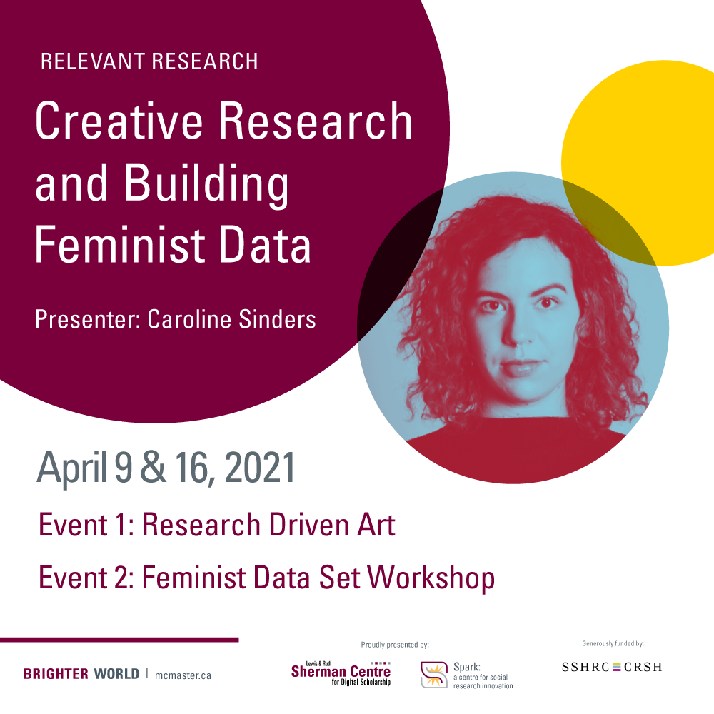

<!-- Edit the content below for the workshop in question. Once you're ready to publish, remove the comment characters e.g. "<!--" at the start and end -->

# Creative Research and Building Feminist Data
**A Relevant Research Series workshop prepared by Caroline Sinders.**

Caroline Sinders explores the intersections of critical design, trauma, data, and artificial intelligence as art. In this workshop, Sinders introduces the methodology she created to guide both her art and research practice: research driven art. Inspired by photojournalism, critical design, and open source software, this methodology is both a process and an approach to knowledge mobilization  

Sinders explores data collection as both art and protest. You will collect feminist data after a brief introduction to machine learning, data, and design thinking. By treating data collection as a collaborative process, you will create a feminist data set from the ground up, while also learning how data collection can be used as an artistic practice and a collaborative, community practice.   

By the end of this workshop series, you will be able to:  

1. Explain research driven art as a methodology and approach to knowledge mobilization

2. Engage in data collection as an artistic practice and as community practice

3. Create a dataset as part of a Feminist AI

The original workshop was recorded and then divided into subsections to allow you to move through the content at your own pace. You can use the accompanying discussion guides to help you engage with core concepts. The discussion will help you focus your learning and build connections across individual videos.  

When you’re ready to begin, please proceed to the Keynote for a discussion on research driven art as a methodology and approach to knowledge mobilization.  

Proceed to the [keynote](keynote) to get started.

___
*Caroline Sinders is a machine learning design researcher and artist. She is the founder of Convocation Design + Research, a design and research agency focusing on the intersections of machine learning, user research, designing for public good, and solving communication difficult problems. As a designer and researcher, she's worked with groups like Amnesty International, Intel, IBM Watson, the Wikimedia Foundation as well as others. She is also a research fellow with Harvard University's Kennedy School of Government and Policy.*
